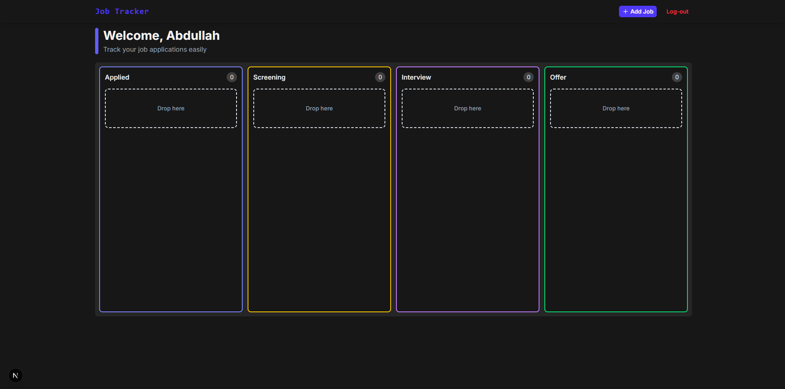
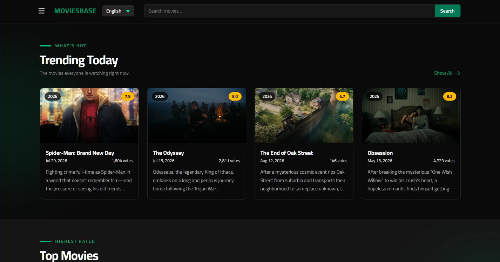
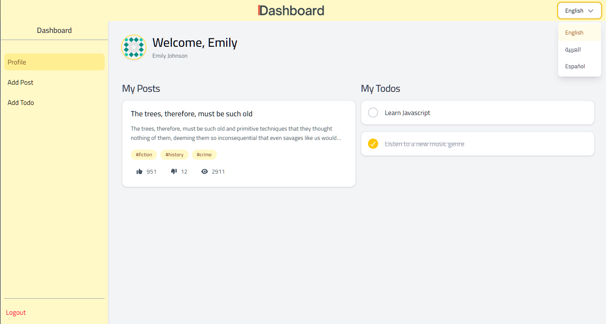

# Hi, I'm Abdullah Naser 👋

Frontend developer building production-quality web apps with **React**, **Next.js**, and **TypeScript** — plus a rare depth in **Arabic i18n engineering**: RTL/BiDi layouts, ICU Message Format, and end-to-end multilingual product ownership.

---

## 🚀 Projects

### [Job Tracker](https://jobtracker-a.netlify.app/) · [GitHub](https://github.com/Abdullah-Nass/jobtracker)

     

Full-stack Kanban board with auth (Better Auth / Neon Auth), Server Actions, and REST Route Handlers. Drag-and-drop across four pipeline columns via **dnd-kit**, optimistic updates with **TanStack Query** cache rollback, and IDOR-hardened queries scoped to `userId`.

---

### [MoviesBase](https://moviesbase-a.netlify.app) · [GitHub](https://github.com/Abdullah-Nass/moviesbase)

    

Multilingual movie discovery app with SSR, SSG, and CSR. Full i18n for EN/AR/ES with localized routes and automatic RTL/LTR switching. Live search with debounce, keyboard navigation, and TanStack Query caching. Tested with **Vitest + React Testing Library**.

---

### [Multilingual Dashboard](https://dashboard-a-n.netlify.app) · [GitHub](https://github.com/Abdullah-Nass/dashboard)

    

Task management SPA with JWT auth, protected routes, and i18n for EN/AR/ES. RTL/LTR layout switching. Forms with React Hook Form + Zod; mutations with TanStack Query.

---

### [MyStore](https://mystore-a.netlify.app) · [GitHub](https://github.com/Abdullah-Nass/mystore)

    

E-commerce SPA with persistent cart (Context + localStorage), category filtering, search, and pagination.

---

## 🛠 Tech Stack

**Frontend**

           

**Backend & Data**

      

**i18n / l10n**

     

**Languages**

 

---

## 📫 Get in Touch

[Portfolio](https://abdullah-nass.github.io/portfolio/) · [LinkedIn](https://www.linkedin.com/in/abdullah-naser04) · [abdula.naser04@gmail.com](mailto:abdula.naser04@gmail.com)
