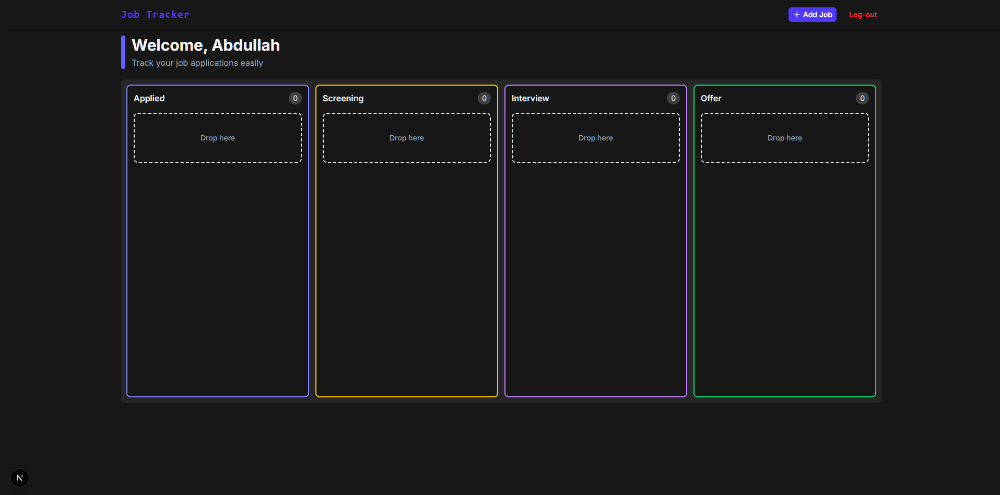
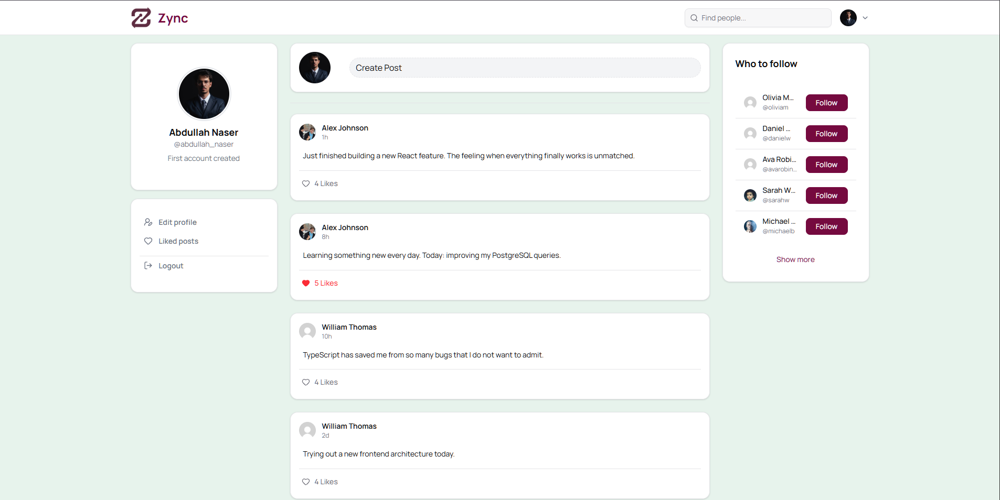
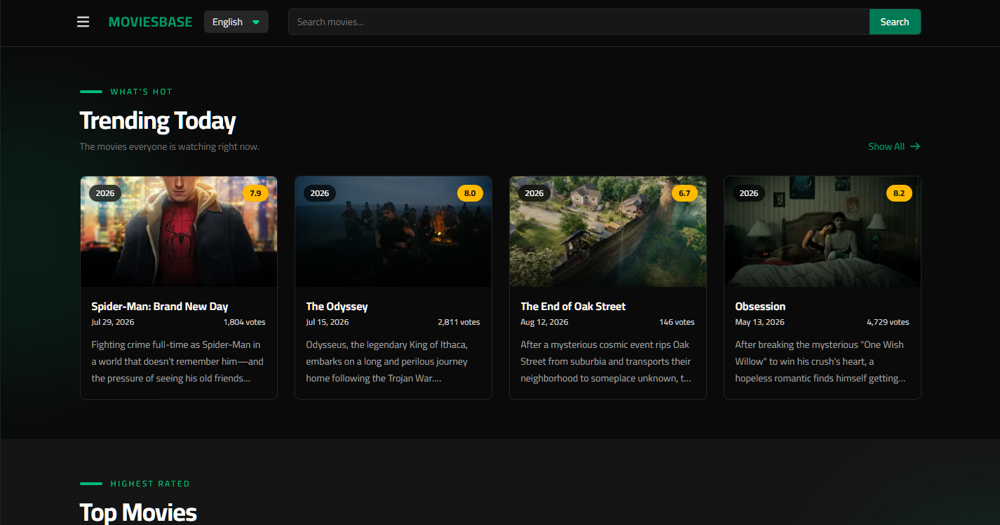
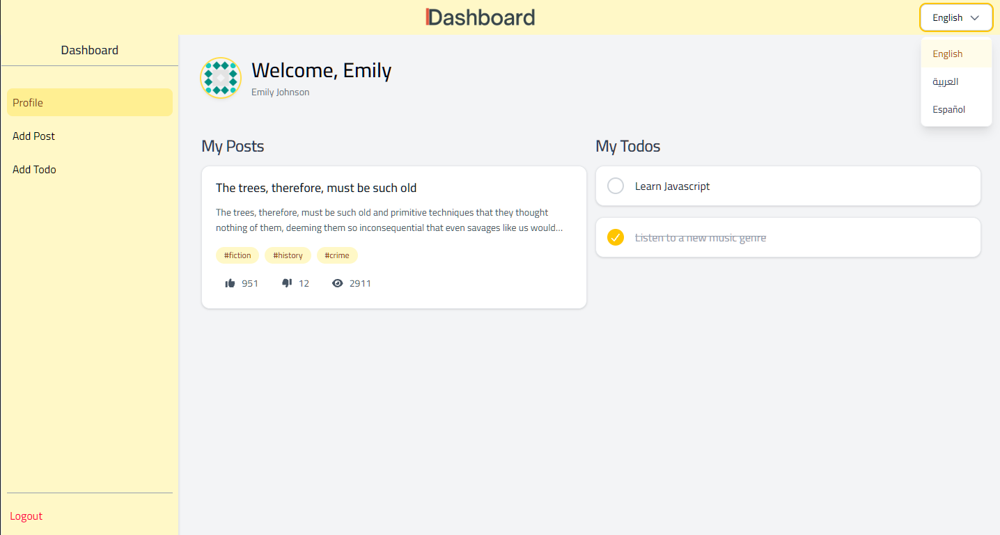
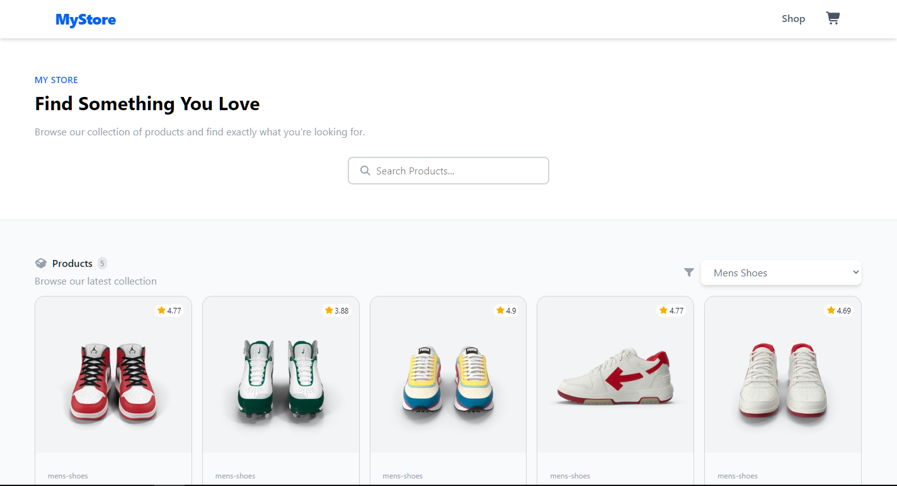

# Hi, I'm Abdullah Naser 👋

**Junior Developer** focused on building scalable, production-quality web applications with **React, Next.js, and TypeScript**.

I enjoy working on complex frontend problems, building polished user experiences, and developing **internationalized applications with solid i18n/l10n architecture**.

---

## 🚀 Featured Projects

### [Job Tracker](https://jobtracker-a.netlify.app/) · [GitHub](https://github.com/Abdullah-Nass/jobtracker)

     

A full-stack Kanban application for managing job applications.

- Authentication with **Better Auth / Neon Auth**
- Drag-and-drop workflows across four pipeline stages using **dnd-kit**
- Optimistic mutations with **TanStack Query**, including cache rollback on failure
- **Server Actions** and REST Route Handlers
- User-scoped database queries designed to prevent **IDOR vulnerabilities**
- PostgreSQL with **Prisma** and Neon

---

### [Waiter](https://waiter-jm3w.onrender.com/en/login) · [GitHub](https://github.com/Abdullah-Nass/waiter) · [▶ Demo](https://www.youtube.com/watch?v=Y7nLLQ_kL0s)

       

A real-time, bilingual restaurant ordering system for waiters, kitchen staff, and admins.

- Custom **Node.js + Socket.io** server pushes new orders to the kitchen board instantly — no polling
- Kitchen status changes notify the waiter as a **live toast** anywhere in the app
- Role-based access control (**Waiter / Kitchen / Admin**) enforced at the layout level
- Cart state managed with **Zustand**; `Order` + `OrderItem` records created atomically via a single **Server Action**
- **30+ tests** with Vitest and React Testing Library covering store actions and role-aware UI components
- Full **Arabic/English** i18n with **next-intl**, automatic RTL/LTR switching, and bilingual data at the DB level (`nameAr`/`nameEn`)

---

### [Zync](https://zync-app.netlify.app/) · [GitHub](https://github.com/Abdullah-Nass)

     

A full-stack social media platform built with a React client and independent Express API.

- JWT authentication with **httpOnly cookies**, implemented without an authentication library
- REST API built with **Node.js, Express, and raw PostgreSQL queries**
- Optimistic likes and follows with synchronized **TanStack Query** caches and rollback
- Infinite scrolling with `useInfiniteQuery` and `IntersectionObserver`
- Debounced search with keyboard-friendly interactions
- Direct browser-to-**Cloudinary** media uploads
- React frontend and Express API deployed independently

---

### [MoviesBase](https://moviesbase-a.netlify.app/) · [GitHub](https://github.com/Abdullah-Nass/moviesbase)

    

A multilingual movie discovery application demonstrating different Next.js rendering strategies and internationalization patterns.

- **SSR, SSG, and CSR** implemented across the application
- Full i18n for **English, Arabic, and Spanish**
- Localized routes with automatic **RTL/LTR** switching
- Live search with debouncing and keyboard navigation
- **TanStack Query** caching
- Component testing with **Vitest and React Testing Library**

---

### [Multilingual Dashboard](https://dashboard-a-n.netlify.app/) · [GitHub](https://github.com/Abdullah-Nass/dashboard)

    

A task management SPA focused on authentication, internationalization, and modern form/mutation patterns.

- JWT authentication with protected routes
- i18n for **English, Arabic, and Spanish**
- Dynamic **RTL/LTR** layout switching
- Forms built with **React Hook Form + Zod**
- Server-state management with **TanStack Query**
- React 19 + TypeScript + Tailwind CSS

---

### [MyStore](https://mystore-a.netlify.app/) · [GitHub](https://github.com/Abdullah-Nass/mystore)

    

An e-commerce SPA focused on client-side state management and a practical shopping workflow.

- Persistent cart using **Context API + localStorage**
- Product search and category filtering
- Pagination and API-driven product data
- Client-side routing with **React Router v7**
- HTTP requests with **Axios**

---

## 🛠 Tech Stack

### Frontend

### Backend & Data

### Internationalization & Localization

### Languages

---

## 💡 What I Care About

- Building maintainable and scalable React applications
- Clean component architecture and reusable UI
- Type-safe frontend development with TypeScript
- Server-state management and optimistic UI
- Authentication and secure API design
- Performance and modern rendering strategies
- Internationalization, localization, and RTL/LTR experiences
- Testing frontend applications with modern tooling

---

## 📫 Get in Touch

**Portfolio:** [abdullah-nass.github.io/portfolio](https://abdullah-nass.github.io/portfolio/)

**LinkedIn:** [linkedin.com/in/abdullah-naser04](https://www.linkedin.com/in/abdullah-naser04)

**Email:** [abdula.naser04@gmail.com](mailto:abdula.naser04@gmail.com)
